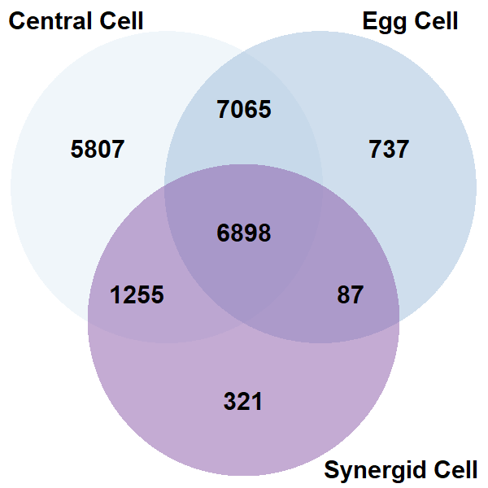

Group members: Joshua M Kemp, Shelly Kinney, Yue Liu

&nbsp;  

***Paper Overview***

Paper: Single-cell RNA-seq analysis reveals ploidy-dependent and cell-specific transcriptome changes in Arabidopsis female gametophytes

Paper link: https://link.springer.com/article/10.1186/s13059-020-02094-0 

Authors: Qingxin Song, Atsumi Ando, Ning Jiang, Yoko Ikeda, & Z. Jeffrey Chen

*Summary:*

Polyploidy and transcriptome changes

&nbsp;

Goal of project: Recreate Fig 5 Venn Diagram

&nbsp;  
***Workflow Details***

Note: specific program details are listed within the code or in a separate file in the Code directory

Note: for rerunning code, make sure code includes references to correct working directories or file locations

&nbsp;

bash script: LCM_dataset_alignment.sh

Obtain the reference genome and its annotation.

Build an index using the reference genome, which will be used for the RNA alignment.

Obtain the RNA sequence data from the SRA database.

  The files will be a compressed version, which must be broken up to obtain paired reads.
  
Take a FASTQC to check RNA read data

Trim the RNA reads

Take a second FASTQC to check the trimming quality 

Align the RNA reads to the indexed genome

Sort the subsequent BAM files

Obtain the read counts from the alignment BAM files

&nbsp;

bash script: sc_rnaseq_analysis.sh

Obtain the reference genome and its annotation.

Build an index using the reference genome, which will be used for the RNA alignmnet.

Obtain the RNA sequence data from the SRA database.
  
  The files will be a compresed version, which must be broken up to obtain paired reads.

Take a FASTQC to check the RNA read data.

Trim the RNA reads.

Take a second FASTQC to check the trimming quality.

Align the RNA reads to the indexed genome.

Sort the subsequent SAM files.

Obtain the read counts from the alignment SAM files.

&nbsp;

UNIX/R script: R_script_to_merge_readcount_files

Create new file with list of file names.

Combine all read count files.

Separate out spike-ins.

&nbsp;

R script: R_for_Venn.R

Take in merged file of read counts.

Separate out data by cell type.

Count the number of reads per cell type.

Separate out read names.

Combine read names and counted reads per cell type.

Select only reads with counts above 0.

Take read names and compare with other cell types in venn diagrams.

Three diagrams are created: 
Diploid, 
Tetraploid,
Total

&nbsp;  
***Results***

Venn Diagram (Figure 5b)

Read count differences; our filtering not as strict as the paper's filtering steps.

Venn diagrams show differences, but overall general trends appear similar.

